Documentation Report
====================

Kickstarter Campaign Analysis
-----------------------------

# Project Description

## Problem Identification

A small-business owner seeking to raise funds through a Kickstarter campaign is entering into an uncertain situation. Campaigners risk their time, energy, and even social reputation. Entrepreneurs may only know the nature of their project, their level of customer support, their projected time and resource costs for the end result, and the goal amount that they believe they need to reach in order for the campaign to be successful. In the event that their campaign fails, the time, energy, and social reputation into the campaign can become a complete loss.

## Context

This project seeks to use data analysis to assist Kickstarter candidates during the research and design stages of their campaigns. Modern data-scraping services provide free data repositories pertaining to Kickstarter. Data features available in the Web Robots - Kickstarter service include information about campaign categorization, goals, backer counts, and more. Using this information, this project can create models that can classify potential new campaigns as likely to be successful or unsuccessful. Furthermore, this project can use the provided features to create K-Means groupings of campaigns, allowing a candidate to explore similar projects as a part of the research phase.

## Criteria for Success

The intended outcome for this analysis is two fold. First, the project aims to create a predictive model that can classify a proposed campaign as either likely to be successful or unsuccessful. With such a model, a small-business owner seeking to use Kickstarter can take their available data and develop their project until they feel they have a campaign proposal that is worth exploring. Small-business owners can use readily available data in their research, such as the number of active and supportive customers they expect for a campaign based on existing business patterns, the cost of product manufacturing and distribution, and the goal amount that they require to meet the threshold for Kickstarter funding. This information matches the model's features.

## Scope of Solution Space

The project uses publicly available data from the Web Robots archives. The data provides features that include campaign status (successful, failed, cancelled, etc.), goal amounts in native currencies, pledged amounts in native currencies, currency exchange rates and USD-adjusted amounts, backers counts, candidates' history of support of other campaigns, categorization and location records, creator information, brief project descriptions, and notable badges and affiliations.

The downloaded data will be converted via data wrangling into a parquet file. With each stage of the data-analysis process, the project creates a new notebook, imports the previous stage's parquet file, performs the necessary operations and analysis, and exports a new parquet file. 

Using tools such as pandas, numpy, matplotlib, and seaborn, the project aims to create visual data analyses. 

An initial goal of the project is to extend beyond the model-creation stage by extending into a network analysis and visualization. This particular aspect of the project is only planned and the project will not include this aspect during the first complete pass, due to time constraints. 

The final output will include a collection of Jupyter Notebook .ipynb files, data-visualization images, a project-report pdf, and a slide presentation. At a future date, the project may expand to include a final outputted network-analysis visualization.

## Stakeholders

This project targets small-business owners that wish to use modern crowdsourcing tools to complete and profit by the means of individual campaigns. The presentation will be made available on the project author's personal website, [https://bluesanta.io](https://bluesanta.io).

Small-business owners can read through this project, follow along with the step-by-step data-analysis process, and develop their own research and models as they consider executing a Kickstarter campaign.

## Constraints

This project is constrained to the data that is publicly available in the Web Robots archive. The archive contains various incomplete cross-sections of the entirety of Kickstarter history. Each dataset is nearly 1GB in size, and there are dozens of datasets. The project will only take one such cross-section for analysis. If a reader is interested to create a more complete collection, they can in theory download each of the archives and synthesize them together. 

Furthermore, the project is constrained to only these few data features that can be quantified and recorded, with a focus on expected backer count, goal amount, and categorization. A Kickstarter campaign is unpredictable, and the reception of the audience is by nature non-quantifiable. A small-business owner can guess, but never foretell an audience's actual reaction.

## Data Sources

The primary dataset for this project is the Web Robot's Kickstarter archive:

[https://webrobots.io/kickstarter-datasets/](https://webrobots.io/kickstarter-datasets/)

# Data Wrangling

Data was obtained from the above listed sources.

The initial download file was over `700MB`, making it cumbersome on a consumer-grade desktop computer. After processing the initial download, converting it to `.csv`, and then finally to a parquet file at the completion of this stage, the final parquet file was less than `50MB`.

The dataset contained the expected features, along with many columns that were redundant. Some of the features were not fit for import altogether, such as the `friend`, `is_starred`, and other features. Excluding these columns eliminated various error warnings that were preventing import into the jupyter environment.

Once imported, the initial dataset was a collection of json rows. The project used a python json library to convert only the relevant information into a pandas dataframe.

The project dropped rows with duplicate and null values, and also all rows where the status of the campaign was `live` or `cancelled`, leaving on `successful` and `failed` campaigns -- the binary outcomes that would be most useful for this analysis.

The resulting limited dataset was exported to a parquet file for the next stage.

# Exploratory Data Analysis

After importing the new parquet file into the new jupyter notebook, the first visualization the project performed was a simple word cloud on the project descriptions.

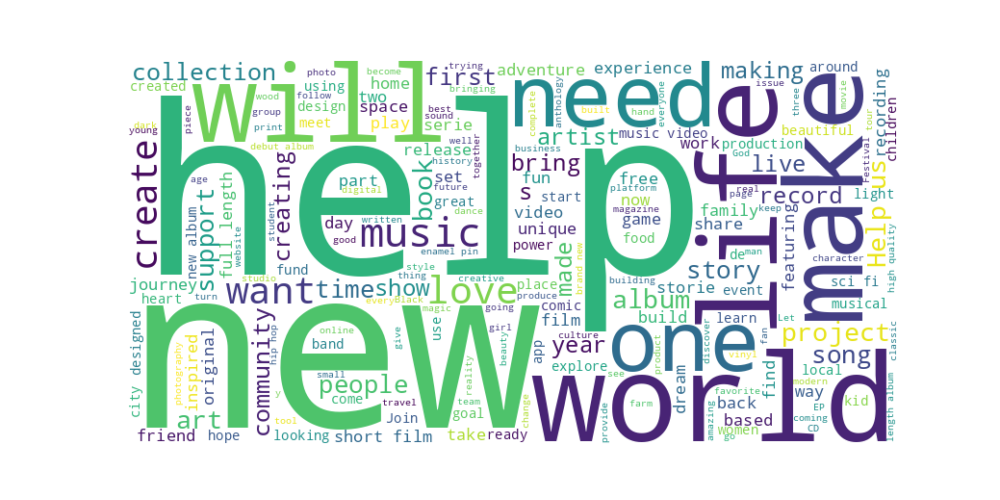

Notable words from the Kicstarter project descriptions include:

- help
- new
- world
- need
- make
- life
- will
- music
- one

The next visualization was a comparison between campaign goals versus their pledged amounts. 

Successful campaigns are in blue and failed campaigns are in green.

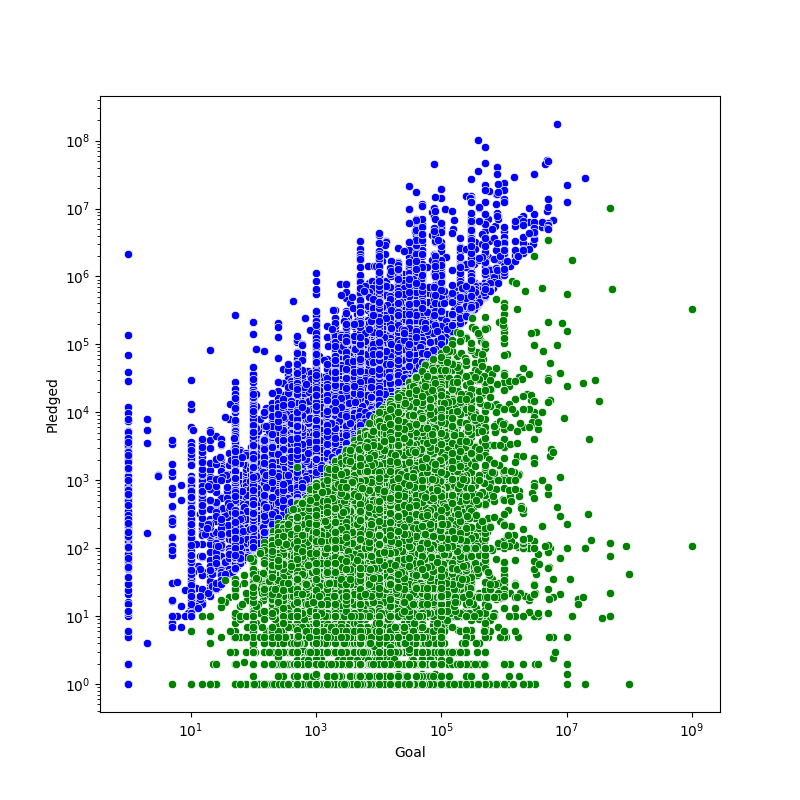

While exploring this visualization and the tailing data points, one project that stood out was the Mystery Science Theater 3000 campaign. This indie film project had goal of only `$2M` and a pledged amount of `$6.5M`. 

[Mystery Science Theater 3000 Kickstarter Campaign](https://www.kickstarter.com/projects/mst3k/makemoremst3k)

On the other end, an overly ambitious project was `Silver Screen Video`. This indie-sitcom campaign requested `$52M` but raised only `$0`. The project seemed to be undeveloped.

[Silver Screen Video](https://www.kickstarter.com/projects/silverscreenvideo/silver-screen-video)

The following visualization shows the number of campaigns run in each country. `US` is the most popular country for Kickstarter, followed by `GB` and `CA`.

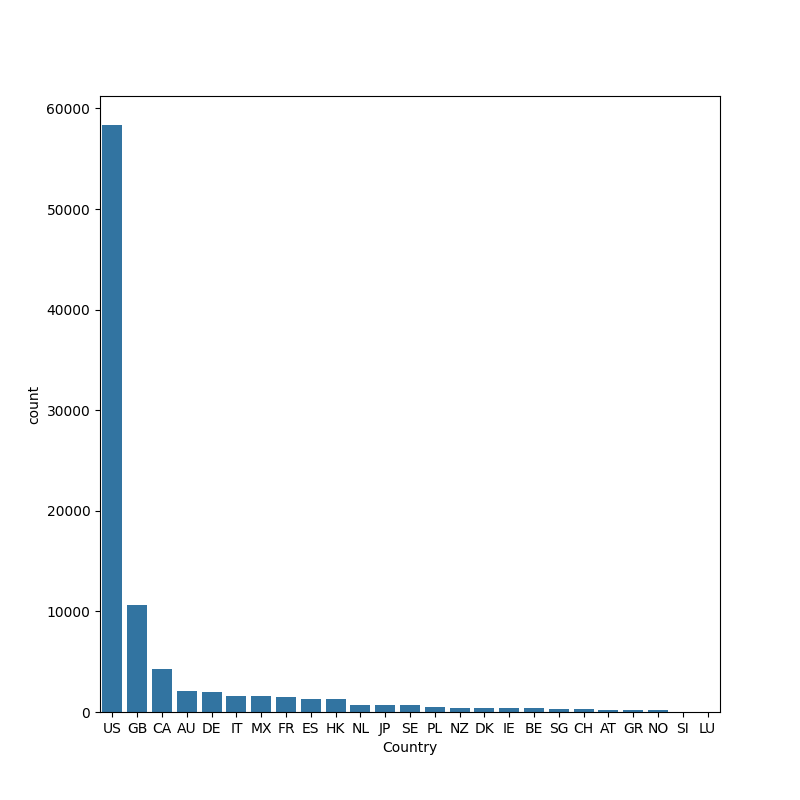
 
As an experiment, the project explored Kickstarter popularity and financial outcomes among countries that do not use `USD`. Notably, `HK` (Hong Kong) has highly popular Kickstarter campaign, with a level of committed financial support that greatly surpassed other countries.

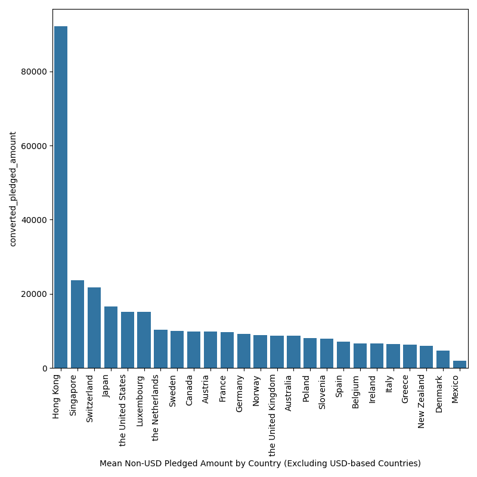

Focusing on Hong Kong, the most frequent outcome for a successful Kickstater campaign was between `$10000` and `$25000` (converted to `USD`).

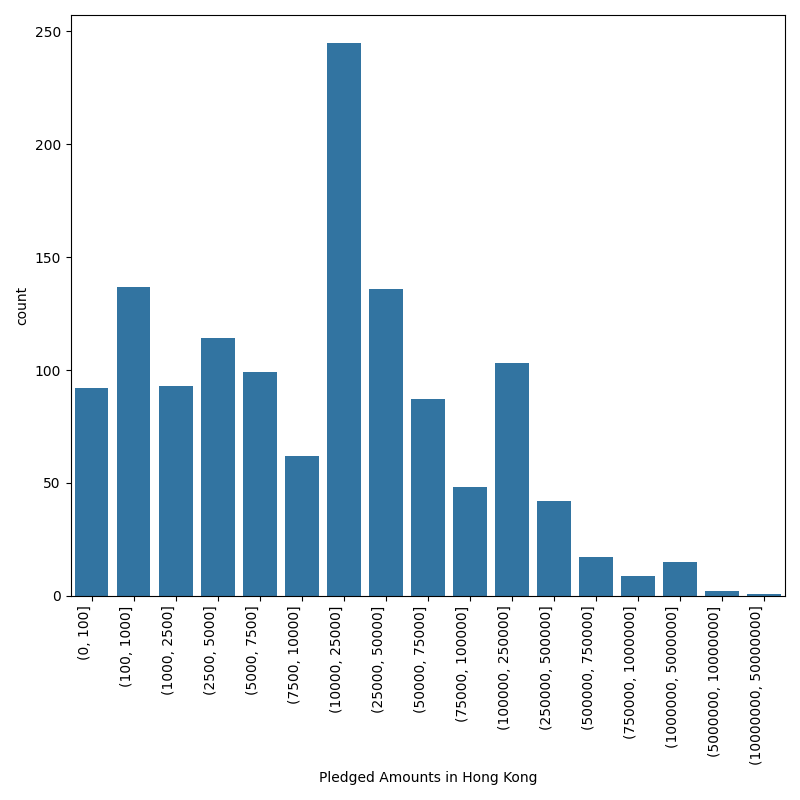

The project also explored average Kickstarter campaign pledged amounts over time. An important note here is that this dataset is limited only to this slice of the Web Robots archive. Therefore, this visualization is likely subject to selection bias.

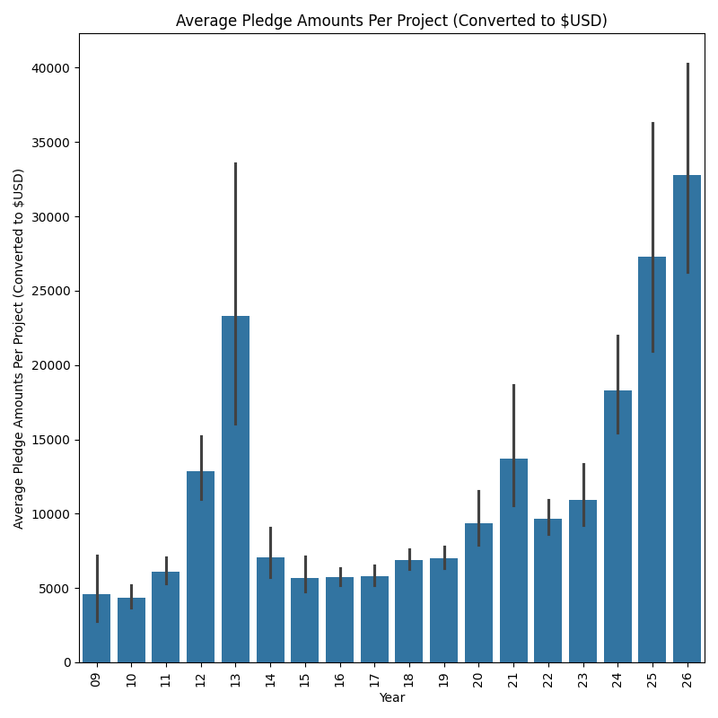

According to the above visualization, Kickstarter had a peak of high average pledge amounts among successful campaigns in the year `2013`, with average pledge amounts at `~$25K`. According to this selective dataset, which may include bias, Kickstarter is currently having a resurgence in popularity with average pledge amounts reaching approximately `$32.5K`.

In another exploration, the project viewed aggregate pledge amounts over time.

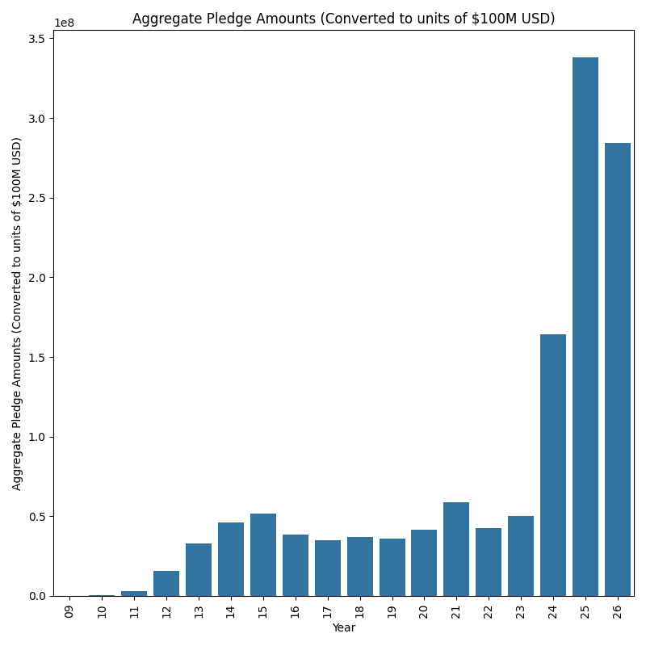

This demonstrates overall audience pledge willingness, but doesn't represent transferred funds because it includes `failed` campaigns.

Limiting to `successful` campaigns provides the following result.

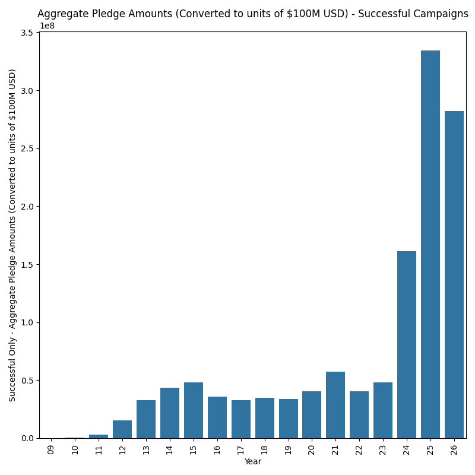

As shown in the above graph, Kickstarter has become exponentially more popular since `2024`, with peak activity of transferred funds per year sitting just below `$350M USD`.

Another curiosity to explore is the ratio of successful campaigns to unsuccessful campaigns. The following visualization may provide insight, however, the factor of selection bias may make this visualization misleading. (If the current dataset excludes historical failed campaigns more frequently in early Kickstarter years compared to current years, the visualization may show a higher level of historical successes than accuracy would require.) 

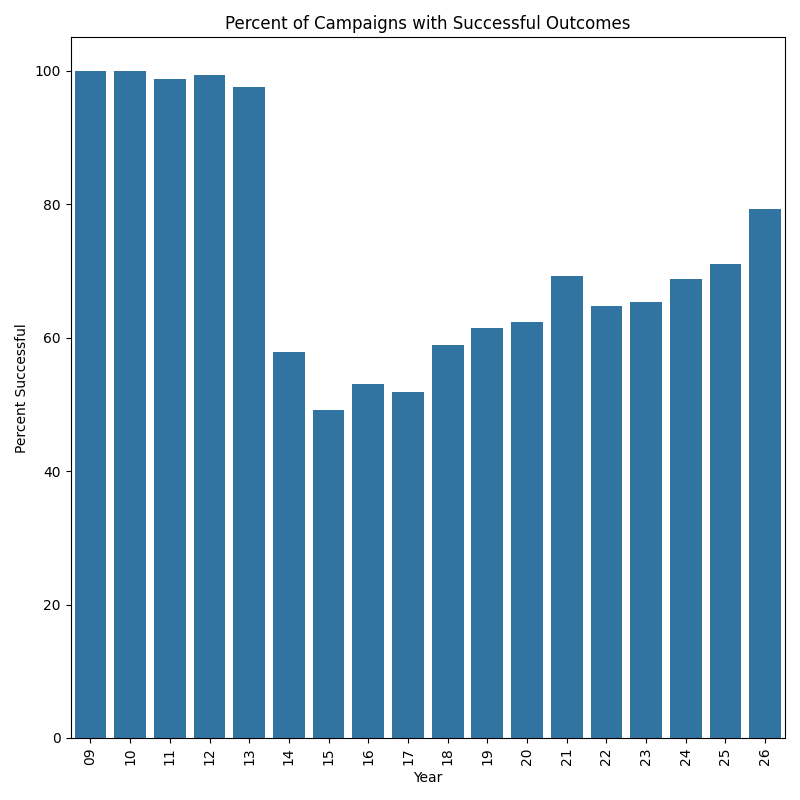

Another interesting insight was that campaigns that receive a `Staff Pick` designation are almost always successful. A small-business owner that receives this lucky support from the Kickstarter team themselves are likely to have a positive outcome.

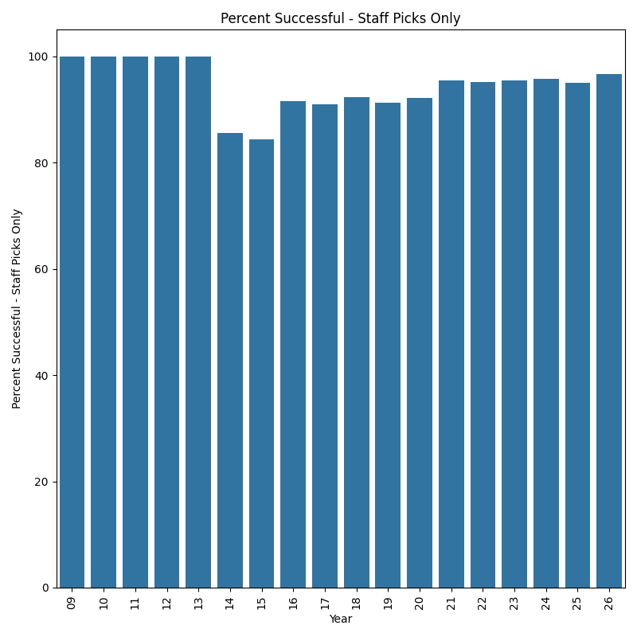

In the following visualization, the graph shows that most campaigns actually have fewer than `5000` backers. Higher numbers of backers are typically found only in extremely popular campaigns that raise more than `$1M`, with a significant peak between `$5M` and `$10M`. Surprisngly, the highest grossing campaigns (`$10M <`) have not quite as many backers on average compared to those in the next lowest bracket. This suggests that the highest grossing campaigns likely have wealthy donors that contribute prodiguous sums.

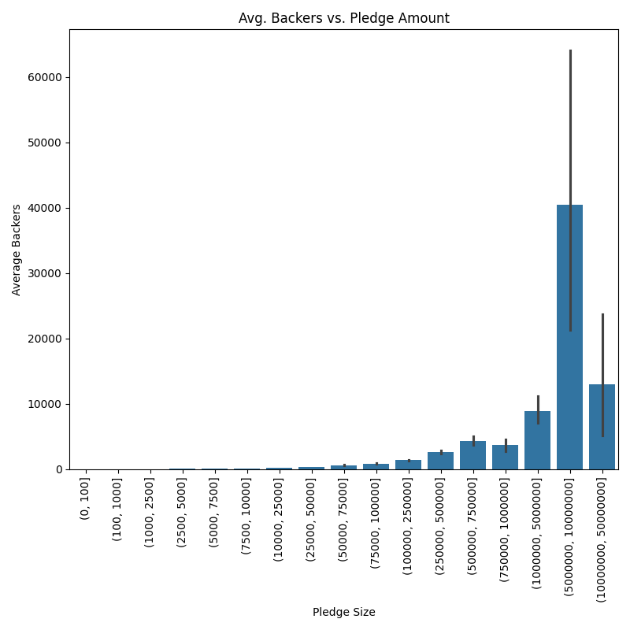

A fascinating insight was found by searching to see which countries have the highest overachieving project. In other words, which countries overshoot the goal amounts by the highest percentage? The answer is `Tz`, which stands for `Tanzania`.

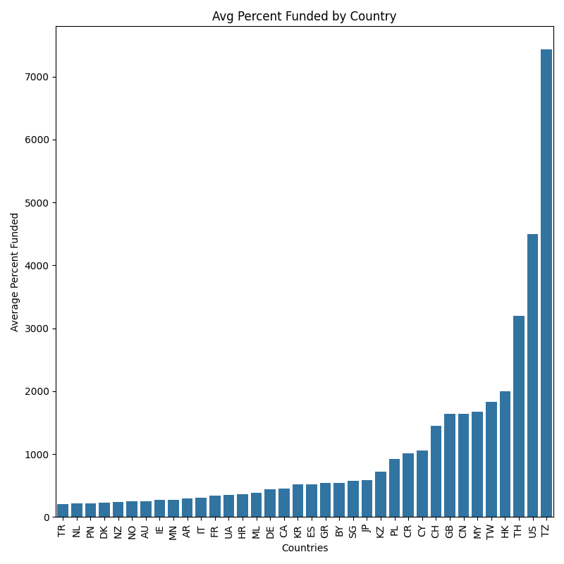

A final observation is the amount pledged by category. The category of `Technology` was the winner by far, with `Games` and `Film & Video` trailing far behind.

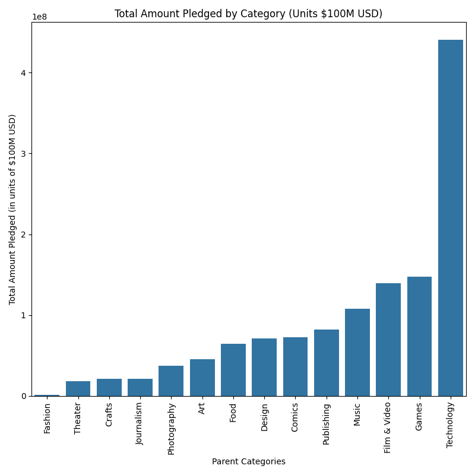

A few actionable insights from this exploratory data analysis are summarized below:

- For small businesses, perform research to discover how many committed donors you expect
  - If you expect only a few, keep your goal at `$100` or below
  - To get to considerable sums of `$25000` to `$50000`, expect to have at least `350` donors or more
- `Technology`, `Games`, `Film & Video`, and `Music` bring in higher sums
- Other categories seem to struggle more to gain pledges
- If you live in Hong Kong or Tanzania, you might find that your market is better off than the US

# Pre-processing, Training, and Modeling

During pre-processing, columns that were no longer needed (as visualization and identification were no longer the focus) were dropped from the set.

The project created dummy variables for categorical features, such as the currency, location, category, and so forth.

The pledged-amount related columns were all dropped, as they are dependent features and cannot be known by a small-business owner before running the campaign.

The modeling stage focused on three models, with the first two being similar in nature and the last serving a different purpose.

## Logistic Regression

The first model experiment was Logistic Regression.

  - This model generates a prediction for each data row regarding its likely chance of successs or failure
  - The model primarily focuses on the features discussed above, including backer count, goal amount, category, and so forth
  - The model has a respectable accuracy score of `0.92`

Using a function provided by the Springboard module for Logistic Regression, the project created a visualization for the Logistic Regression model's decision boundary.

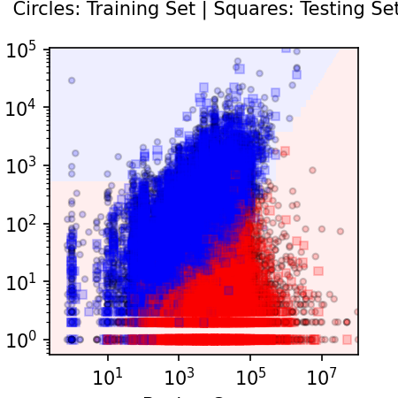

Note that the failed projects (in blue) have higher goal amounts than the successful projects (in red). A simple insight from this visualization can be that projects that fail often have overly ambitious goals.

To visualization the Logistic Regression model's accuracy, the project created a confusion matrix.

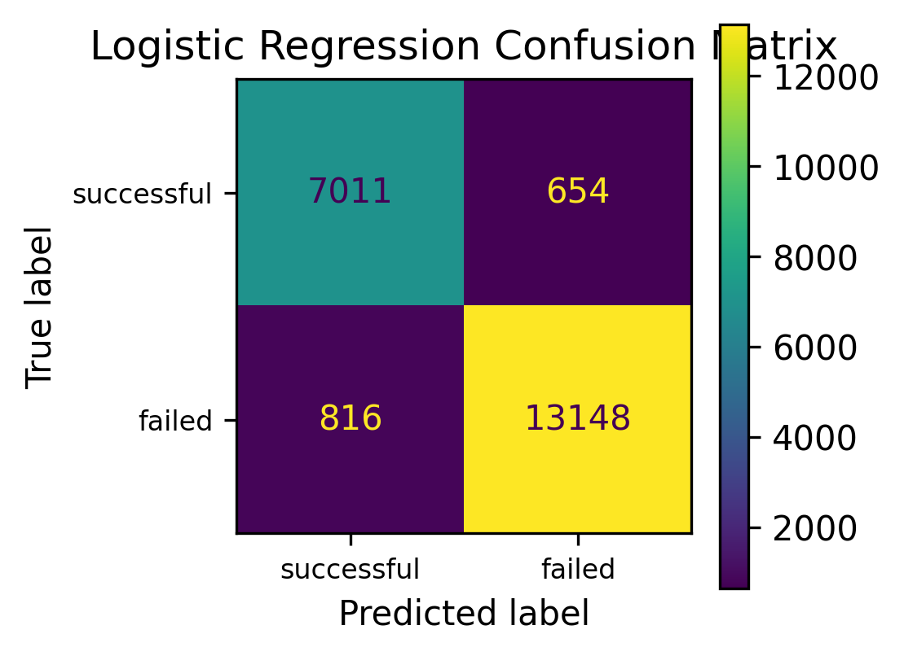

## Decision Trees

As another exploration, the project considered a decision-tree model, `Random Forest Classifier`.

The outcome for this model was an accuracy of only `0.896`, which was far less than the `0.92` of the Logistic Regression model.

While this model does appear to be useful, it is less competitive.

## KMeans Clustering

As a final model exploration, the project reviewed the predictive capacity of the KMeans Clustering model.

With `~86000` rows in the final dataset, there were a significant number of clusters to gatherin into groups.

The project first used the inertia-elbow method to decide on the appropriate number of clusters.

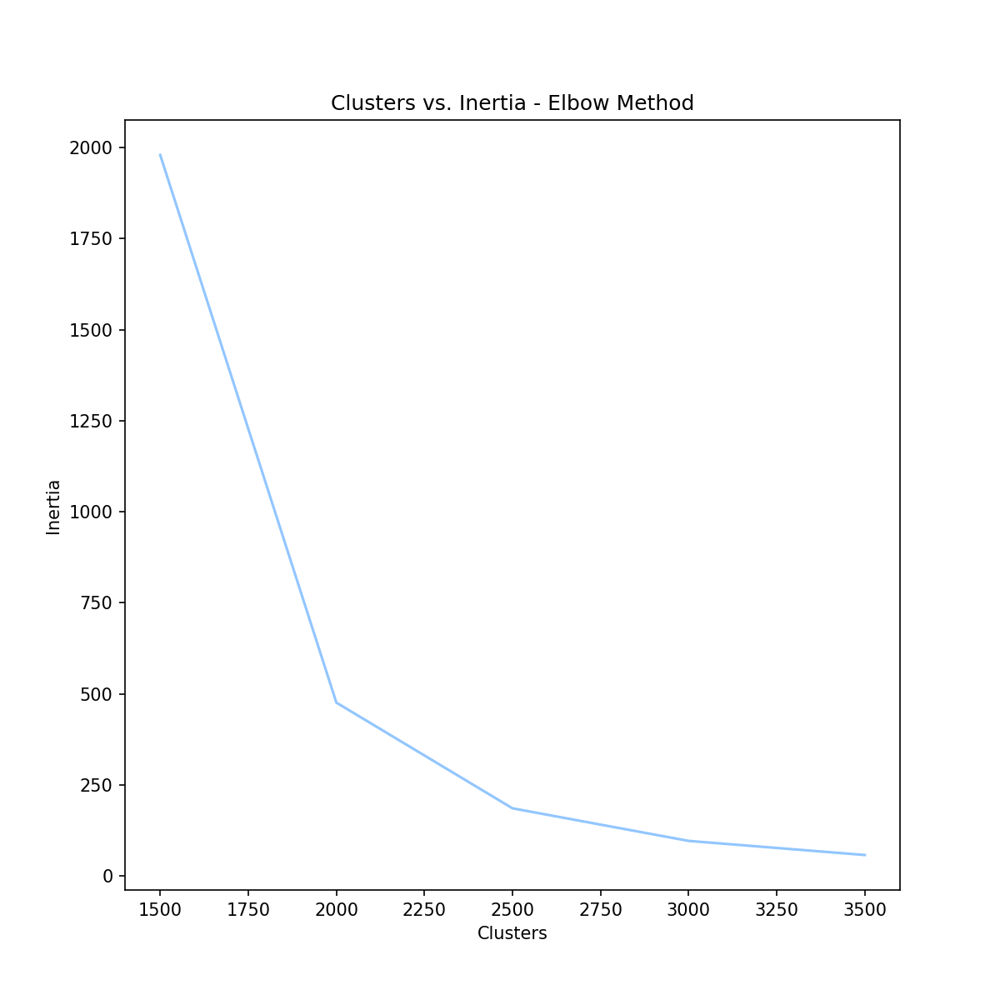

Using this method, the decided appropriate number of clusters is `2500`.

As an additional hyperparameter, the initialization for KMeans cluster uses the `k-means++` parameter, which encourages starting points for clusters to be spread out.

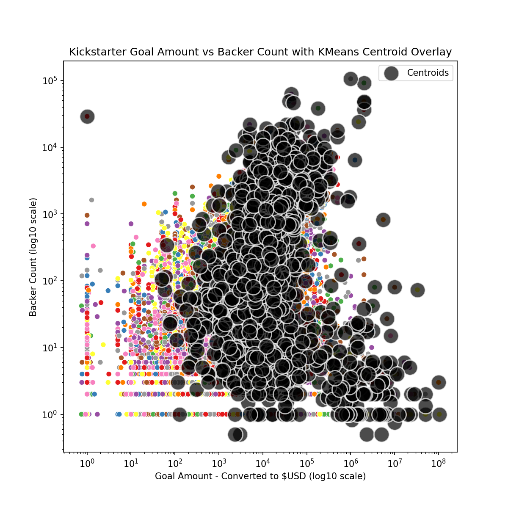

At a glance, the cluster centroids seem to accurately capture the clustering of the data. 

Where the KMeans cluster becomes useful, however, is when a researcher compares a proposed project to other projects that are predicted to be in the same cluster.

Take the following project into account:

- The proposed campaign expects `100` people to support the Kickstarter campaign
- The currency is `USD`
- This is the first project
- The country is `US`
- The topic is `comics`, which has a relevant category of `3.0`
- The candidate hopes for `$1500`, meaning that each of the theoretical `100` customers will contribute, on average, `$15`.

Using these parameters and the KMeans Cluster model, the cluster id number that this proposal would match is `1949`.

From here, a researcher can explore other projects that are in this similar cluster.

One of these clusters is the following project -- a comic series that had a successful outcome.

[The Center of Somewhere - Vol. 1 Small Town Heroes](https://www.kickstarter.com/projects/eightgunshots/the-center-of-somewhere-vol-1-small-town-heroes)

This shows that other comics, of a similar nature, have a history of meeting their goals. In this instance, the goal amount was `$2000` and the pledge outcome was `2126`.

# Conclusion

Overall, this project has been a success. The initial goal was to use publicly available Kickstarter datasets, data analysis methods, and predictive modeling to create a research methodology that a small-business owner can use during the research and development stage of a proposed project.

As shown in the final steps of this project, a small-business comic-book creator could use this data to ascertain whether or not they have the support necessary to obtain a desirable outcome.

The Logistic Regression model was particularly useful, with an accuracy score of `0.92`, beating the Random Forest model's `0.896`.

The KMeans Clustering method revealed a promising method for categorizing Kickstarter campaigns and matching a candidate's campaign proposal to historical campaigns with similar aspects. This process could have great value in the research and development stage.

A next step for this project to consider at a later date would be to use network analysis and visualization to create a visual web of Kickstarter campaigns and their relationship to each other and common attributes. As this idea extends far outside of the methods and education of the Springboard Academy curriculu, this idea is set aside for future explorations.
